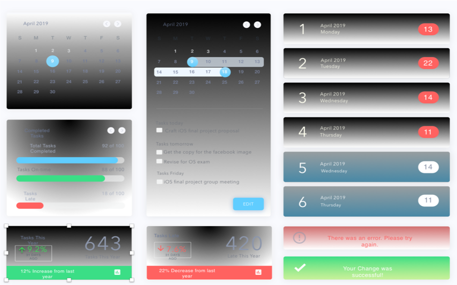
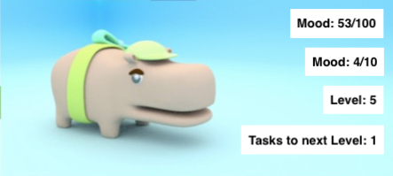
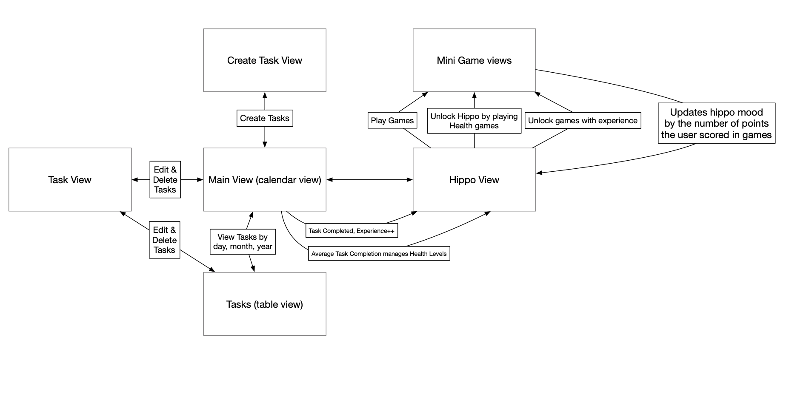
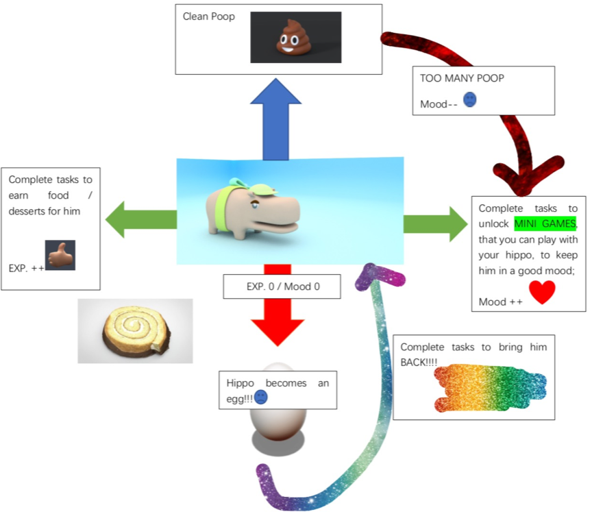

Will Powers

Isabella Tochterman

Wenyin Zheng

# Planner Pet

## Overview and Overall Logic

'Planner Pet' is a task manager and arcade in one app. Tasks can be created with due dates and can be viewed in a table view and calendar view. The completion of a task is added to a total count and the completion of tasks per week are maintained as an average. Included in the app is an animated hippo that follows the user around from view to view. 

If the user's average tasks per week are too low, then the hippo will have poor health consequences, this includes hunger, excessive bowel movements and turning into an egg. These poor health consequences can only be solved by feeding the hippo or cleaning up the hippo's excrement. These will be simple actions like wiping at a poop icon to get it to disappear or flicking treats at the hippo that are available once the user complete tasks. Likewise doing well and raising the user's total count of tasks above certain thresholds allow for the unlocking of new, more fun games. 

Minigames that come unlocked on the app are memorization games for tasks and upcoming due date. Points of the Minigame will be added to a counter for the hippo's mood that diminished slightly every day. There will be a maximum mood that the hippo can have

There will be an embedded view of the hippo in each task view. There will be a view for monitoring the hippo's health and there will be a view for each minigame.

### Mini-Games

**Hippo Run** - The hippo is running forward and the tilting the device shifts the hippo's position to the left and right. There will be objects gaining size over time to simulate them coming closer to the hippo. If the object reaches its max size and the hippo overlaps with the view of the object, then the game is over simulating that the hippo has been squashed. However, if the hippo is not squashed by an object then a point is added to the hippo's total mood.

**(Potential) Cup Guessing**- there will be 3 cups on the screen. One cup is lifted and the hippo walks under it. The cup is lowered over the hippo. Then the cups interchange positions rapidly and the user is asked to pick which cup the hippo is under. The cup that the user clicks will be lifted. If it is the one that the hippo was placed under then the hippo appears and 1 point will be added to the hippo's mood.

## Intended Audience

The Primary Audience is children 5-12 who are having trouble learning work management skills. A secondary audience is people of any age who are lacking those skills as well and who find the process of task management to be boring and unengaging. The app intends to engage them with the mini-games and have the process of task management be only a cursory experience in order to complete the games that they perhaps more interest in
	
## Resources Needed
* Animations will be created with Maya 2018 and Core Animations
*	Open Source will be used to create scaffolding for Table and Calendar Views of Tasks
*	MySQL database will store tasks

## Technical Challenges
*	Merging Video and in-app 
*	Learning databases for the app 
*	Integrating all the different views
*	Creating the main view that splits between a table view and the calendar view

## Mock-up of major Task screens and views

 
## High-Level Flowchart

 
## Features to implement by May 4th

1. **Main View/Calendar:** 
This first view is comprised of a calendar at the top of the screen, and daily task headlines for a selected day below it  

2.   **Create New Task View:**
The second view will allow the user to create a new task by specifying duration as well as task description. 

3.   **Daily Task Detailed View:**
This third view will display detailed versions of the tasks indicated in the main view. 

4.   **Weekly Task View:**
This fourth view will display all tasks for a given month and can be toggled via a segment controller.

5.  **Monthly Task View:**
This fourth view will display all tasks for a given month and can be toggled via a segment controller.

5.   **Yearly Task View:**
This fifth view will display all tasks for a given year and can be toggled via a segment controller.

6.   **Pet View:**
Check up on the user's pet after completing a day of tasks to watch the radical visualization of virtual satiation. 

7.   **Game View: **
Load up games and play them to memorize the user's goals, heal the user's pet and just have fun! 

## Partner Assignments

* **Will** - Main View and database
* **Isabella** - Task Views and database
* **Wenyin** - Pet View, Game view and games

## Features to Implement after May 4th

*	Adding pictures to Task

*	Adding Notifications
*	Linking Maps to tasks
 *	Notifications when the user is nearby a task
 *	Estimated travel time

*	Creating a house for the pet to live in

*	Allowing the pet to live a fulfilled and happy life with a loving spouse

## Open Source Uses
Check Documentation/OpenSourceLicences for more info

* Copyright (c) 2013-2016 FSCalendar (https://github.com/WenchaoD/FSCalendar)
# shopping-purchase-prediction
# shopping-purchase-prediction
